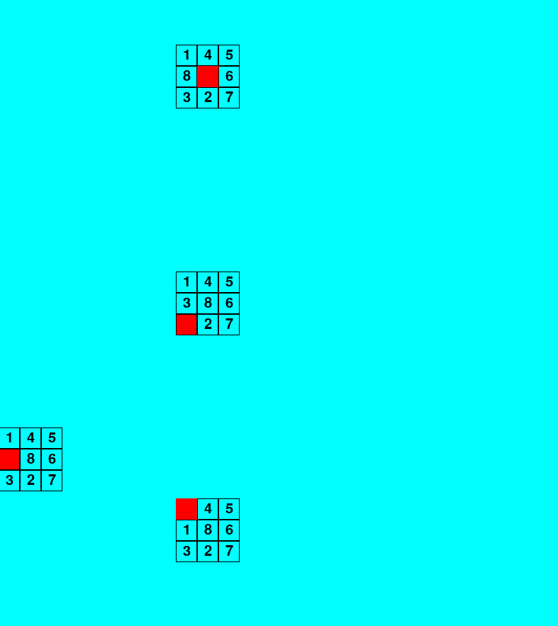
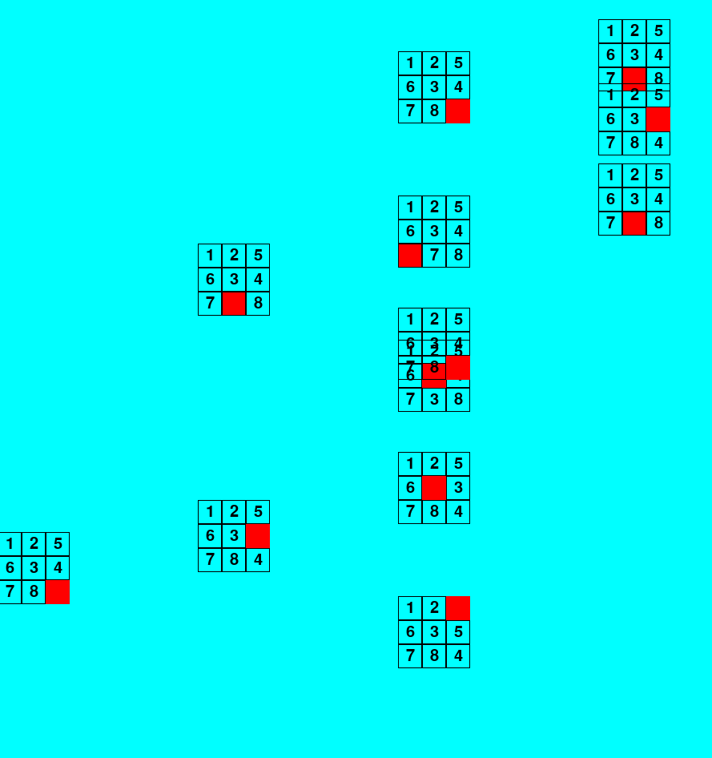

# 8-Puzzle game
Given a configuration of the board, it is requested to reach the initial board with the fewest number of steps.

```
|1|2|3|
|4|5|6|
|7|8|0|
```

The 8-Puzzles Game is modeled through the `BFS algorithm`, starting from the initial board towards the established configuration and the answer will be its depth.





Then, the following Python packages need to be installed:
## Requirements
```
Pygame: 2.5.2
```

